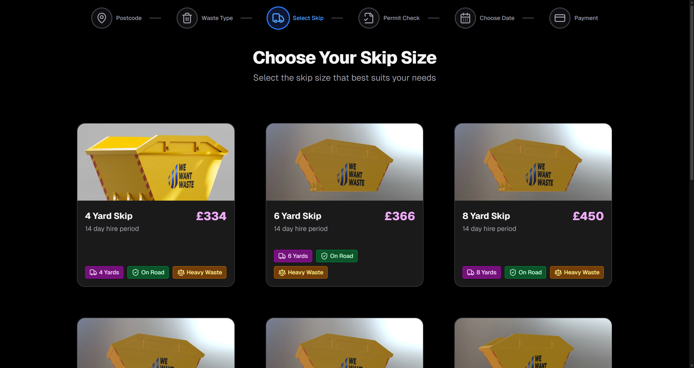
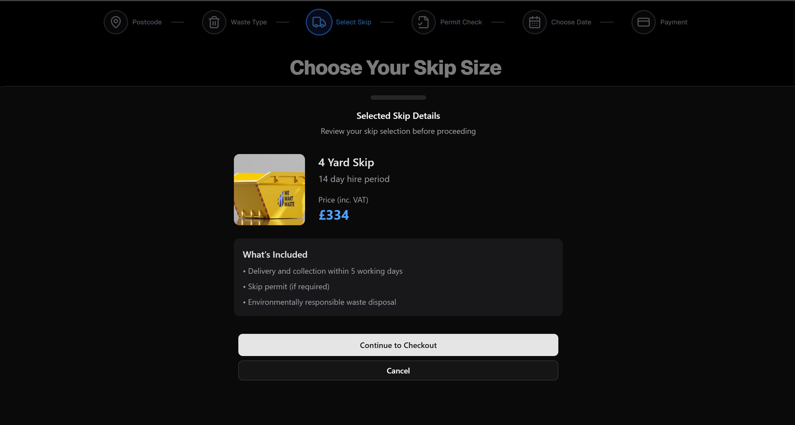
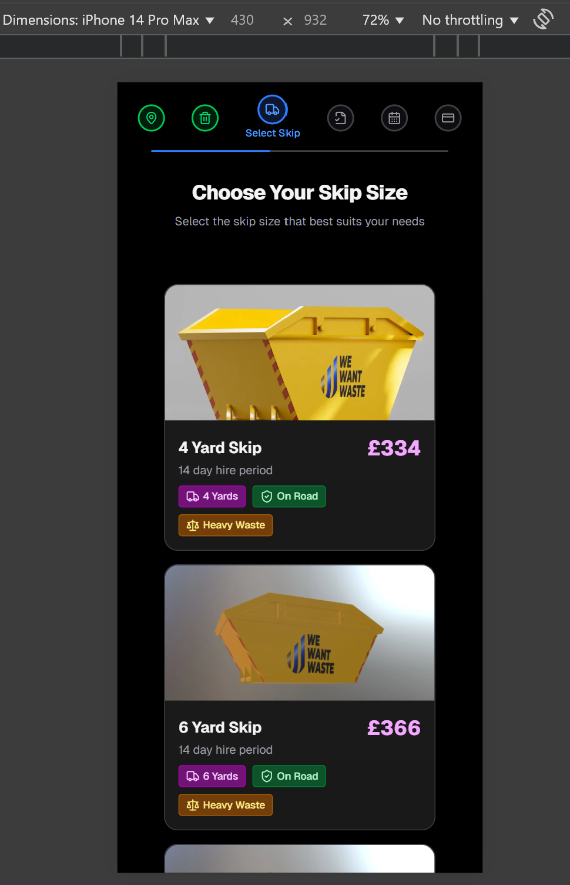
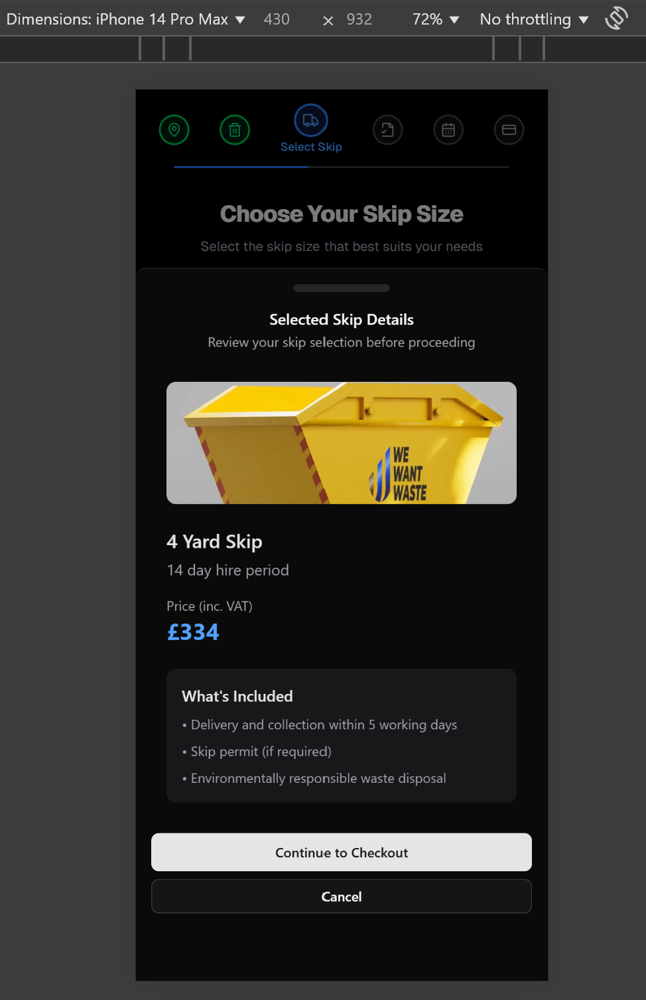

# REM Waste Challenge Documentation

A responsive web application built entirely in React using Next.js and TypeScript that provides an intuitive interface for selecting waste skip sizes. The application features smooth animations, mobile-optimized interactions, and a clean, modern design.

## Key Features

- **Most up-to-date Design**: Features a slick and modern design up to date with the latest trends in UI/UX
- **Shadcn UI Components**: Follows the current React trends of beautiful UI components
- **GSAP Animations**: Again following the direction of the latest and greatest movements in the React community
- **Responsive Design**: Fully optimized for desktop, tablet, and mobile devices
- **Interactive Skip Cards**: Hover animations and selection states
- **Dynamic Mobile Detection**: Hover effects automatically disabled on touch devices, static hover instead
- **Loading States**: Skeleton loading components during data fetching for maximum UX
- **Card Drawer**: Detailed/informative skip panel instead of a plane boring bottom bar
- **Progress Tracking**: Visual progress indicator for the booking flow on smaller devices
- **Browser compatibility**: All JS animations/components work in all the modern browsers

## Getting Started

After cloning this repository using git, you will need to set up the development environment:

### Prerequisites

Node.js (version 20 or higher recommended).

### Installation Steps

1. **Install dependencies**
   ```bash
   npm install
   ```

2. **Run the development server**
   ```bash
   npm run dev
   ```

3. **Open your browser**
   Navigate to `http://localhost:3000` to see the application running.

### Alternative package managers
If you prefer yarn or pnpm:
```bash
yarn install
yarn dev

pnpm install
pnpm dev
```

## Project Showcase Display




